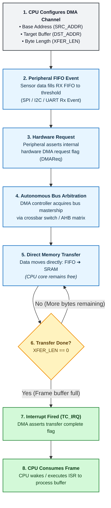

# Direct Memory Access (DMA) Architecture for High-Throughput Hardware Telemetry

In high-speed embedded architectures, polling or interrupt-driven I/O transfers consume significant CPU overhead. Direct Memory Access (DMA) provides a hardware-level pipeline that transfers multi-byte telemetry payloads directly between digital communication peripherals (SPI/I2C/UART) and internal SRAM without CPU core intervention.

---

## 1. Traditional Interrupt Servicing vs. DMA Architecture
When acquiring high-frequency burst telemetry from sensors (such as continuous pressure/temperature streams from external MEMS devices), standard interrupt handlers incur context-switching penalties for every transferred byte.

| Characteristic | Interrupt-Driven I/O (ISR) | Direct Memory Access (DMA) |
| :--- | :--- | :--- |
| **CPU Core Utilization** | High (Context switch on every byte/word). | Near Zero (CPU only handles transfer completion). |
| **Bus Mastership** | CPU Core executes load/store instructions. | DMA Controller arbitrates internal system bus. |
| **Data Throughput** | Limited by ISR latency and clock cycles. | Limited only by bus arbitration and peripheral FIFO. |
| **Silicon Overhead** | Minimal (Standard NVIC peripheral). | Requires dedicated DMA channel & descriptor tables. |

---

## 2. DMA Transaction Pipeline & State Flow
A typical DMA transaction consists of four discrete phases:

---

1. **Descriptor Initialization:** The CPU configures the DMA channel register set:
   * **Source Pointer (`SRC_ADDR`):** Base address of the peripheral Data Register (e.g., `SPI_RX_BUF`).
   * **Destination Pointer (`DST_ADDR`):** Target base address inside internal SRAM buffer.
   * **Transfer Counter (`XFER_LEN`):** Total byte length allocated for incoming burst data.
2. **Peripheral Request Trigger:** When the sensor transmits bytes over the bus, the peripheral FIFO reaches its trigger watermark and asserts an internal hardware DMA request (`DMAReq`).
3. **Autonomous Bus Arbitration:** The DMA controller requests bus mastership via the internal crossbar switch, transferring data directly from peripheral FIFO into SRAM.
4. **Completion Interrupt (`TC_IRQ`):** Once `XFER_LEN` decrements to zero, the DMA controller asserts a single transfer-complete interrupt flag, notifying the CPU that a complete frame is available for processing.

---

## 3. Circular Buffer Implementation with Ping-Pong Descriptors
For continuous real-time streaming, modern DMA controllers employ **Linked List Descriptors (Ping-Pong Buffers)**. This architecture prevents data corruption while the application layer parses telemetry:

* **Buffer A (Active DMA Target):** The DMA hardware writes incoming sensor frames directly into Buffer A.
* **Buffer B (CPU Processing):** Simultaneously, the CPU processes, filters, or transmits previous data from Buffer B.
* **Descriptor Toggle:** Upon completion of Buffer A, the hardware automatically switches the destination pointer to Buffer B and generates an interrupt, swapping processing roles without dropping packets.

---

## 4. Hardware Edge Cases & Memory Coherency

When documenting and designing DMA-driven firmware architectures, hardware engineers must account for the following silicon edge cases:

* **Cache Coherency (ARM Cortex-M7 / High-Performance MCUs):** If data cache (D-Cache) is enabled, the DMA controller updates SRAM directly, leaving the CPU cache stale. Firmware must explicitly invalidate D-Cache lines before reading DMA memory regions.
* **SRAM Alignment Constraints:** Many DMA controllers require 32-bit aligned memory boundaries (`__attribute__((aligned(4)))`). Non-aligned target buffers trigger hardware bus faults during burst reads.
* **Bus Master Contention:** Heavy DMA traffic across shared internal bus matrices can introduce memory stall cycles on latency-critical CPU threads.
